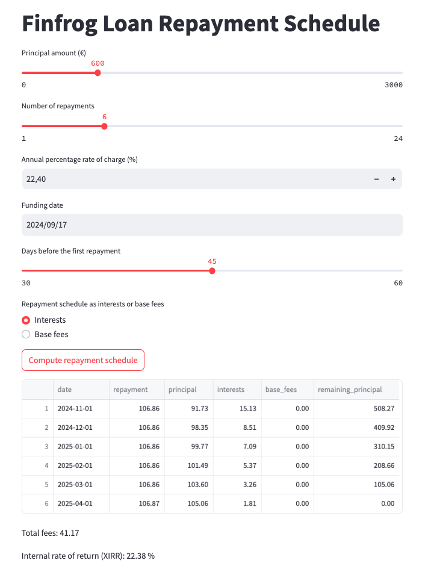

# loan-calculator-py
Loan calculator in python

## Installation

Install project with uv: https://docs.astral.sh/uv/

```bash
uv sync
```

## Usage

Use it in a python script:

```python
from datetime import date

from loan_calculator import run_loan_calculator

repayment_schedule = run_loan_calculator(
    amount=60000,
    taeg=0.209,
    number_repayments=6,
    funding_date=date(2024, 1, 1),
    days_first_repayment=45,
    as_interests_or_base_fees="interests",
    as_json=True,
)
print(repayment_schedule)
```

```json
[
    {
        "date": "2024-02-15",
        "amount_repayment": 10640,
        "amount_principal": 9220,
        "amount_interests": 1420,
        "amount_base_fees": 0,
        "amount_remaining_principal": 50780
    },
    {
        "date": "2024-03-15",
        "amount_repayment": 10640,
        "amount_principal": 9869,
        "amount_interests": 771,
        "amount_base_fees": 0,
        "amount_remaining_principal": 40911
    },
    {
        "date": "2024-04-15",
        "amount_repayment": 10640,
        "amount_principal": 9976,
        "amount_interests": 664,
        "amount_base_fees": 0,
        "amount_remaining_principal": 30935
    },
    {
        "date": "2024-05-15",
        "amount_repayment": 10640,
        "amount_principal": 10154,
        "amount_interests": 486,
        "amount_base_fees": 0,
        "amount_remaining_principal": 20781
    },
    {
        "date": "2024-06-15",
        "amount_repayment": 10640,
        "amount_principal": 10303,
        "amount_interests": 337,
        "amount_base_fees": 0,
        "amount_remaining_principal": 10478
    },
    {
        "date": "2024-07-15",
        "amount_repayment": 10642,
        "amount_principal": 10478,
        "amount_interests": 164,
        "amount_base_fees": 0,
        "amount_remaining_principal": 0
    }
]
```

## Streamlit demo

Start a streamlit demo:

```bash
uv run streamlit run streamlit_app.py --server.port 8501
```

Then, go to http://localhost:8501/ to see this:



## Tests

Run tests with pytest:

```bash
uv run pytest -vv
```